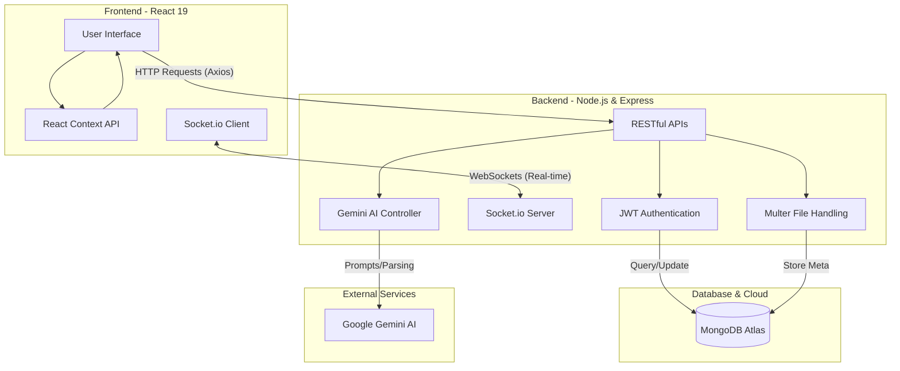
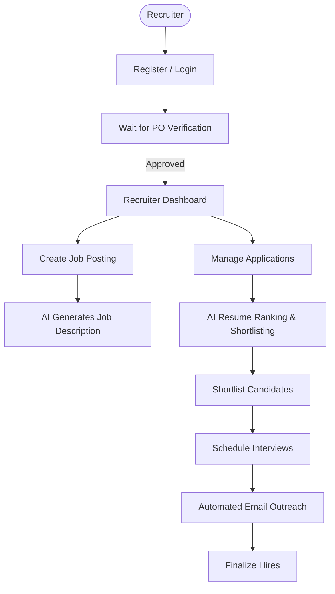
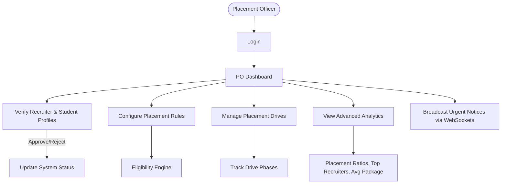
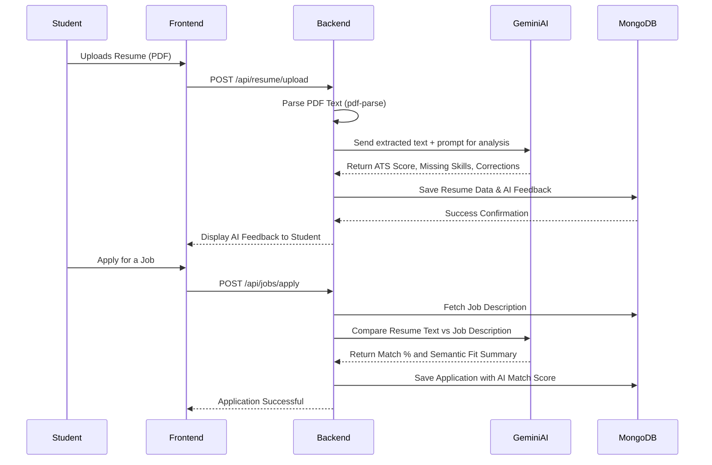
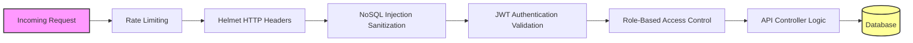

# Smart Placement Portal - Complete Flow Architecture

This document provides a comprehensive overview of the system architecture, data flow, and user journeys within the **Smart Placement Portal**. It is designed to help developers, stakeholders, and recruiters understand the platform's inner workings.

---

## 1. High-Level System Architecture

The platform follows a robust Client-Server architecture utilizing the MERN stack and Google Gemini AI for advanced intelligent features.

---

## 2. Core User Journeys

The portal is decentralized into distinct modules for different users, ensuring a streamlined placement lifecycle.

### 2.1 Student Journey Flow
Empowers students with intelligent profiling, AI resume feedback, and automated skill assessments.

```mermaid
flowchart TD
    S([Student]) --> Reg[Register / Login]
    Reg --> Profile[Complete Profile & Upload Resume]
    Profile --> AI_Res[AI Resume Analyzer]
    
    AI_Res -- ATS Score & Feedback --> Dashboard[Student Dashboard]
    
    Dashboard --> Jobs[View & Apply for Jobs]
    Jobs --> AI_Match[AI Job Matching Percentage]
    
    Dashboard --> Prep[Interview Preparation]
    Prep --> Coding[Coding Lab Challenges]
    Prep --> MockInt[AI Mock Interviews]
    
    Dashboard --> Track[Track Application Status]
```

### 2.2 Recruiter Journey Flow
Streamlines the hiring pipeline for corporate partners using AI-driven shortlisting and matching.

### 2.3 Placement Officer (PO) Journey Flow
The command center for university placement coordinators to oversee and regulate the entire drive.

---

## 3. Data Flow & AI Integration Lifecycle

This diagram illustrates how data flows securely through the system when a student uploads a resume and applies for a job, showcasing the Gemini AI integration.

---

## 4. Enterprise-Grade Security Flow

Ensuring absolute protection of student and corporate data is paramount.

## 5. Technology Stack Summary
* **Frontend**: React 19 (TypeScript), Tailwind CSS, React Router, Recharts
* **Backend**: Node.js, Express.js, Socket.io
* **Database**: MongoDB (Mongoose)
* **AI Integrations**: Google Gemini API (`@google/genai`)
* **Security**: JWT, bcryptjs, Helmet, Express-Rate-Limit, express-mongo-sanitize

---
*Generated for the Smart Placement Portal Project.*
